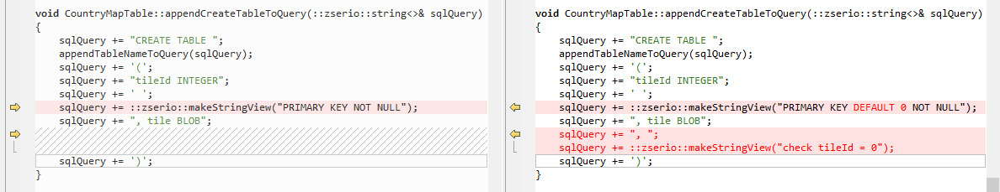
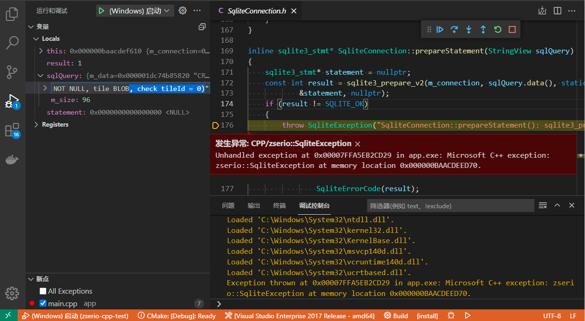

# Test topic

Refer to the definition of SmartLayerMetadaTable (NDS.Live).

The modified definition of the CountryMapTable is as follows:

``` java
sql_table CountryMapTable
{
    /** Refer to the definition of SmartLayerMetadaTable (NDS.Live), just to reproduce the wrong scene.*/
    int32   tileId sql "PRIMARY KEY DEFAULT 0 NOT NULL";
    Tile    tile;

    sql("check tileId = 0");
};
```
The source code differences are as follows:


# Testing environment

* zserio-2.8.0
* sqlite3-3.39.4
* zs file: come from [zserio](https://github.com/ndsev/zserio/tree/master/test/language/sql_databases/zs)
* Source code (cpp) generation command:

``` shell
java -jar zserio.jar -src zs -cpp cpp sql_databases.zs
```

# Build project

``` shell
mkdir build && cd build
cmake .. && make install
```

# Debugging

The problem is caused by the addition of ``", check tileId = 0"`` characters.

I don't quite understand the meaning and role of defining this line. Maybe there is something wrong with the way I use it.


